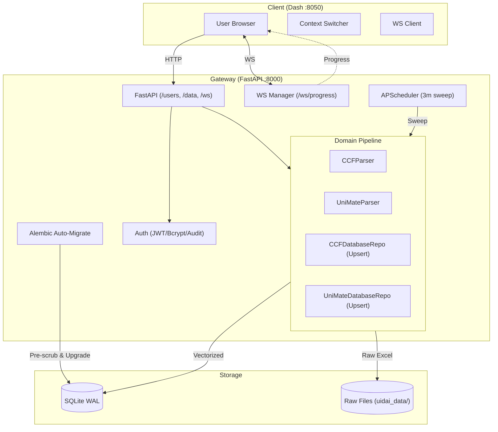
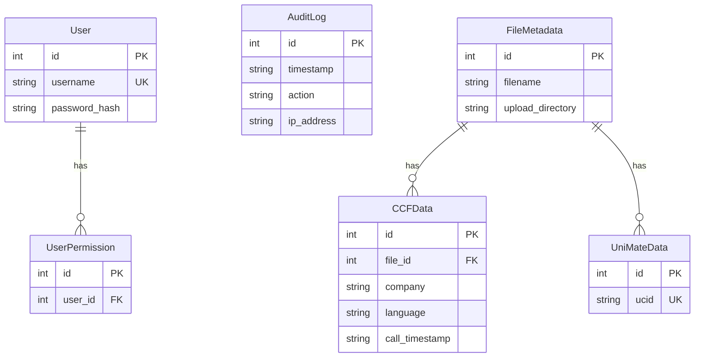

# UIDAI DB Platform Arch

> **Class:** Eng Blueprint  
> **Target:** Core Eng  
> **Status:** Prod

---

## 1. Vision

Platform = multitenant analytics + ops intel. Ingest/audit national CCF ops + IVR/UniMate journeys.

Distributed arch:
- **Backend**: FastAPI. Async ETL + pure domain parse + repo upsert + RBAC + audit log + dynamic cron sweep + auto-schema-migrate.
- **Frontend**: Dash/Plotly. Dynamic context + multi-page + clientside auth + AG-Grid.



---

## 2. Tech Stack

- **Backend**: Python 3, FastAPI, Uvicorn, SQLAlchemy, Alembic (schema), APScheduler.
- **Frontend**: Dash, Plotly, Dash Bootstrap Components, AG-Grid.
- **Storage**: SQLite (WAL mode). File system (raw Excel/CSV).
- **Data Proc**: Pandas, NumPy, OpenPyXL.

---

## 3. Auto Schema Evolution & Migration Recovery

SQLite `ALTER TABLE` weak. Alembic batch mode = new table → copy data → swap.
Fail risk: existing dirty data break `UNIQUE` constraints. 
Soln: Auto-heal pre-migration in `startup_event`.

**Workflow:**
1. App boot → `Base.metadata.create_all()` (safe init).
2. Scan `_alembic_tmp_*` → DROP. Clean dead lock/fail states.
3. Pre-migration dedupe: Scan DB. Find constraint risk (e.g., `user_permissions` duplicate `user_id`).
4. Execute `DELETE` → keep `MAX(id)`. Force DB clean.
5. `command.upgrade("head")` → guaranteed success.

No touch. Zero downtime schema sync on `git pull`.

---

## 4. Domain Model

| Term | Def | Logic |
| :--- | :--- | :--- |
| **SL %** | Answered ≤ 20s. | `(ACD_Calls_20s / (Call_Offered - ABAN_10s)) * 100` |
| **AHT** | Avg Handle Time (talk+hold+acw). | `(Talk + Hold + ACW) / Total_ACD` |
| **SLA Score** | Perf rules. | `SL > 85%` → Good, else Penalty. `AHT <= 240s` → Good. |
| **DNIS Map** | Vendor ID via IVR prefix. | `56*` → Digitech. `57*` → NSB. |
| **Time Bucket** | Auto-resolution. | `≤7d` → Day. `>31d` → Week. `>90d` → Month. |
| **Tenant Iso** | Scope data via JWT. | Filter by `companies` claim. |
| **Audit Prov** | Strict action log. | Capture `X-Forwarded-For`, `User-Agent`. |

---

## 5. Deep Module Arch

```
┌───────────────────────────────────────────────┐
│               FastAPI Router                  │
└───────────────────────┬───────────────────────┘
                        ▼
┌───────────────────────────────────────────────┐
│               Domain Ingestion                │
├───────────────────────────────────────────────┤
│ • CCFParser/UniMateParser (pure fn)           │
│ • CCFRepo/UniMateRepo (1000-chunk upsert)     │
│ • WS Manager (progress stream)                │
└───────────────────────────────────────────────┘
```

| Seam | Pub API | Impl Depth |
| :--- | :--- | :--- |
| `auth_utils` | `get_current_user()`, `archive_old_logs()` | JWT, lazy bcrypt upgrade, 90d prune. |
| `*Parser` | `parse()` | OpenPyXL iteration, vectorized KPI + SLA deriv. |
| `*Repo` | `save_parsed_data()` | `on_conflict_do_update` composite UPSERT. |
| `api_client` | `get_dataframe()` | `requests.Session` pool, LRU cache. |

---

## 6. Execution Lifecycle

### Ingest + WS Async
Client POST `/upload` → API spawn `process_file_background` → return 200.
Worker broadcast WS % → Parse → Vectorize → Batch Upsert → Audit Log → WS 100%.

### Auto Cron
APScheduler (3m) → Query `ActiveFoldersConfig` → Scan `uidai_data/` → Dispatch worker for unindexed files.

### Auth
POST `/login` → verify bcrypt → lazy rehash if old → Insert `AuditLog` → Issue JWT (roles/companies). Dash client timeout = 30m inactivity block.

---

## 7. DB Schema


**Constraints:**
- `FileMetadata`: UK `(filename, upload_directory)`.
- `CCFData`: UK `(company, language, call_timestamp)`. Idempotent re-upload.
- `UniMateData`: UK `(ucid)`.

---

## 8. ADRs

**ADR 1: WS Async Upload** → HTTP POST + WS client_id stream. Zero UI block on 50MB files.
**ADR 2: Relational Idempotent Upsert** → Composite constraints + SQLite `on_conflict_do_update`. Prevent dupe records.
**ADR 3: Provenance Audit** → `ApiClient` forward headers (`X-Forwarded-For`). True origin trace.
**ADR 4: Domain vs Repo Split** → Pure parse functions + dedicated DB I/O classes. High testability.
**ADR 5: Dynamic DB Cron** → Read `ActiveFoldersConfig` from DB. Zero-downtime folder swap.
**ADR 6: Auto-Heal Migrations** → Scrub duplicate constraint violators pre-alembic `upgrade()`. Robust `git pull` deploys.

---

## 9. Prod Specs

1k concurrent user spec:
- Compute: 4-8 vCPU.
- RAM: 8-16GB (Pandas mem).
- Disk: 50GB NVMe (SQLite WAL IOPS).
- Kernel: `fs.file-max=65535`, `net.ipv4.tcp_max_syn_backlog=4096`.
- Ports: `80/443` (Nginx) → internal `8000/8050`.
