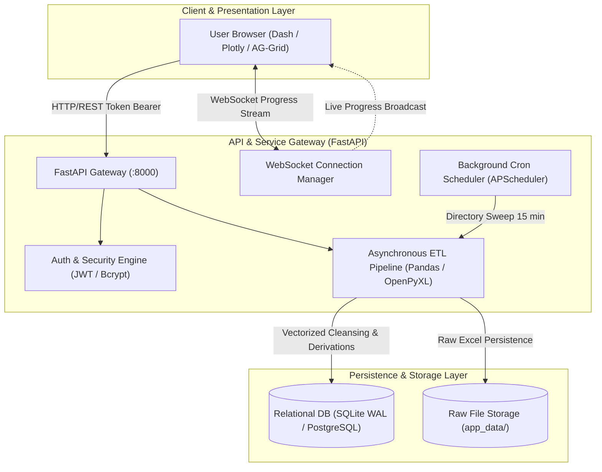
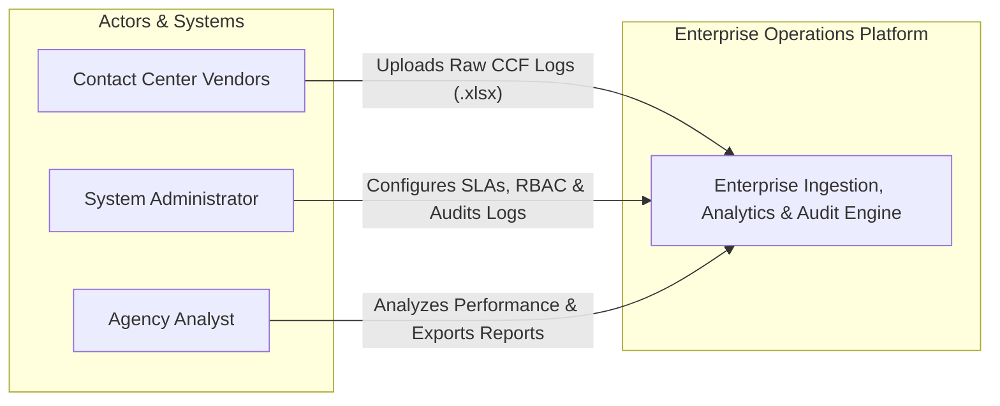
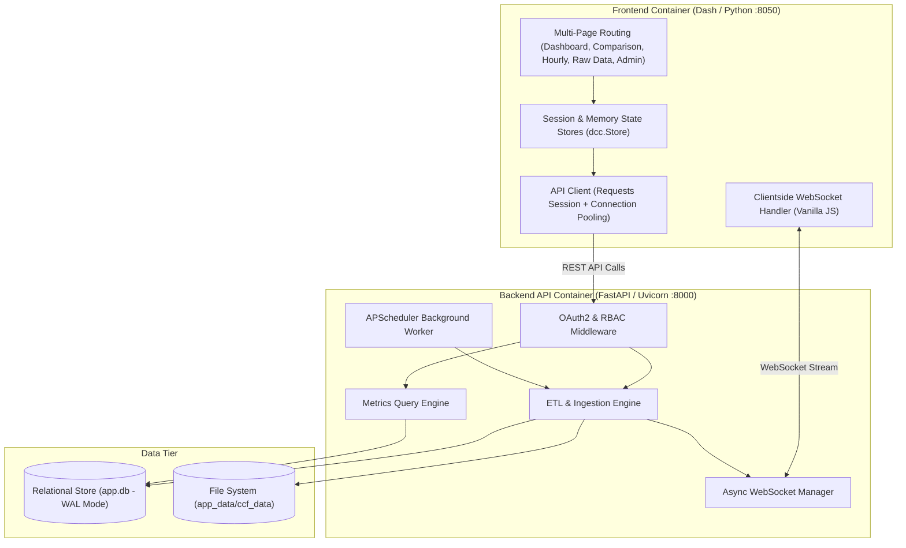
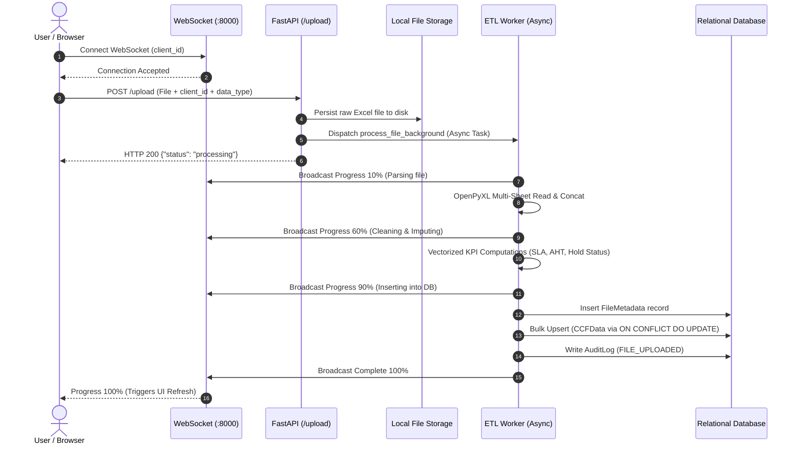
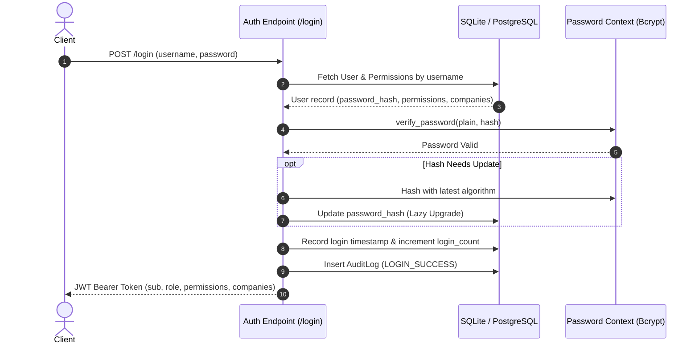
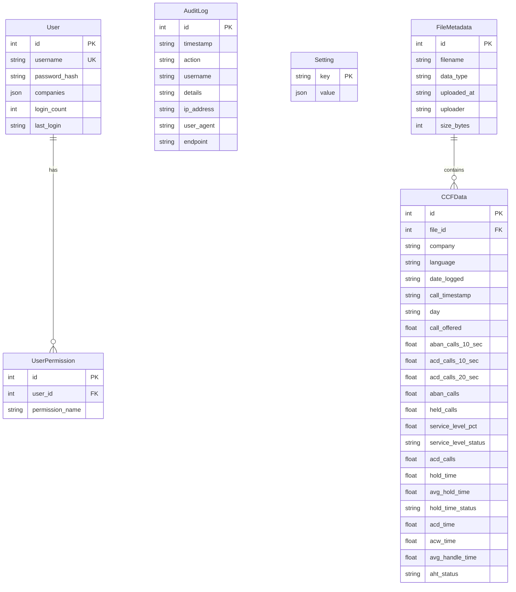

# Enterprise Contact Center Operations & Analytics Platform
## System Architecture & Technical Deep-Dive Specification

> **Document Classification:** Engineering Architecture & Operational Blueprint  
> **Target Audience:** Technical Leadership, System Architects, Core Engineering Team  
> **Status:** Active / Production-Ready

---

## 1. Executive Summary & System Vision

The **Enterprise Contact Center Operations & Analytics Platform** is a specialized, multi-tenant analytics and operational intelligence system engineered to monitor, analyze, and audit large-scale Contact Center Facility (CCF) operations. 

The platform bridges high-volume contact center operational telemetry (call volumes, agent handle times, service level agreements, abandoned call rates) and executive reporting. It features a distributed architecture combining a **FastAPI backend** (ETL pipeline, asynchronous processing, RBAC, audit logging) with an **interactive Dash/Plotly analytical frontend**, backed by a relational metrics store optimized for high-throughput vectorized operations.



---

## 2. High-Level Architecture & System Boundaries

### 2.1 System Context



### 2.2 Container Topology



---

## 3. Domain Model & Ubiquitous Language

The domain model follows strict Domain-Driven Design (DDD) principles:

| Domain Term | Canonical Definition | Mathematical / Logic Model |
| :--- | :--- | :--- |
| **Service Level (SL %)** | The percentage of answered calls connected within threshold (20s). | `SL % = (ACD_Calls_20s / (Offered - ABAN_10s)) * 100` |
| **Weighted Average SL** | Period-level Service Level aggregated across all volume intervals rather than naive arithmetic mean. | Accurate summation across aggregate call volume denominators. |
| **Average Handle Time (AHT)** | Total time an agent spends processing a customer interaction across all stages. | `AHT = (Talk_Time + Hold_Time + Wrap_Time) / Total_ACD_Calls` |
| **Average Hold Time** | Average duration a caller is placed on hold per answered interaction. | `Avg_Hold = Total_Hold_Time / Total_ACD_Calls` |
| **Answer Rate** | Proportion of offered calls handled by agents. | `Answer_Rate = (ACD_Calls / Calls_Offered) * 100` |
| **Dynamic Time Bucketing** | Automated time-series aggregation resolution based on selected date ranges. | `≤7d` -> Daily; `>31d` -> Weekly (`W-MON`); `>90d` -> Monthly (`MS`). |
| **Tenant Isolation** | Scoped data accessibility where tenant metrics are segmented at query time. | Query filtering constrained by JWT token claims (`companies` attribute). |
| **Lazy Password Upgrading** | Transparent cryptographic re-hashing upon login to update deprecated hashes. | Re-hashes on verified match if algorithm upgrade flag is active. |

---

## 4. Deep Module Architecture

```
┌─────────────────────────────────────────────────────────────┐
│                    FastAPI Router Layer                     │
└──────────────────────────────┬──────────────────────────────┘
                               │ (Clean Interface)
                               ▼
┌─────────────────────────────────────────────────────────────┐
│                 Deep Module: ETL Pipeline                   │
│   (backend/data_ingestion/websockets.py)                    │
├─────────────────────────────────────────────────────────────┤
│ • Multi-sheet OpenPyXL parsing                              │
│ • Column sanitization & type coercion                       │
│ • Vectorized pandas KPI derivations                         │
│ • SLA penalty classification rules                          │
│ • SQLite ON CONFLICT DO UPDATE batch upserts                │
│ • Real-time WebSocket step & progress streaming             │
└─────────────────────────────────────────────────────────────┘
```

### 4.1 Module Summary Table

| Module Seam | Public Interface | Implementation Depth (Hidden Complexity) |
| :--- | :--- | :--- |
| **`auth_utils`** | `verify_and_upgrade_password()`, `get_current_user()`, `PermissionChecker()`, `add_log()` | JWT encoding/decoding, passlib context switching, fallback bcrypt compatibility, request IP/User-Agent extraction, audit log persistence. |
| **`ETL Engine`** | `process_file_background(path, filename, client_id, user, data_type)` | Async I/O, multi-sheet aggregation, missing-value imputation, derived formula execution, batch chunking, SQLite upsert handling. |
| **`api_client`** | `ApiClient.get_dataframe()`, `ApiClient.login()`, `ApiClient.upload_file()` | Session pooling (`requests.Session`), client header propagation (`X-Forwarded-For`), client-side LRU memory caching. |
| **`theme & export`** | `get_plotly_template()`, `make_header_with_download()`, `wrap_graph_with_download()` | Universal PostHog-inspired design tokens, dynamic PDF/PNG/HTML export dropdown bindings, skeleton loaders. |

---

## 5. End-to-End Data & Execution Lifecycles

### 5.1 Ingestion & Asynchronous ETL Lifecycle



### 5.2 Authentication & RBAC Verification Lifecycle



---

## 6. Database Schema & Data Models



---

## 7. Architectural Decision Records (ADRs)

### ADR 0001: Asynchronous WebSocket Progress Streaming
* **Context**: Uploading multi-sheet 50MB Excel files with 100,000+ rows takes 5–15s. A standard synchronous HTTP POST blocks client without feedback.
* **Decision**: Adopt dual-channel upload pattern. Client initiates WebSocket connection with `client_id`, then fires async upload. FastAPI processes data in `BackgroundTasks` while broadcasting granular percentage updates.
* **Consequences**: Zero UI freezing, predictable user feedback, decoupled HTTP request timeout risks.

### ADR 0002: Relational Metrics Storage with Unique Composite Constraints
* **Context**: Raw CCF logs are frequently re-uploaded with overlapping intervals or revisions.
* **Decision**: Store all normalized records in a single indexed metrics table (`ccf_data`) constrained by `(company, language, call_timestamp)`. Utilize SQLite `on_conflict_do_update` (Upsert).
* **Consequences**: Full idempotency during file re-uploads; prevents duplicate record inflation.

### ADR 0003: Connection-Forwarded Audit Logging
* **Context**: The frontend communicates with the backend via an internal network proxy/client. Standard backend logging would record `127.0.0.1` as client IP.
* **Decision**: `ApiClient` forwards incoming Flask request headers (`X-Forwarded-For`, `User-Agent`, endpoint route) to FastAPI headers, where `auth_utils.extract_request_metadata()` extracts real client provenance for compliance logging.
* **Consequences**: Non-repudiation audit trails for sensitive user actions (logins, password resets, data exports).

---

## 8. Production Hardware & Sizing Profile

Designed for **1,000 concurrent sessions**:

- **Compute**: 4–8 vCPUs (Ubuntu 22.04 LTS)
- **Memory**: 8GB – 16GB RAM (Optimized for in-memory Pandas dataframe slicing)
- **Storage**: 50GB+ Enterprise NVMe SSD (High IOPS for SQLite WAL operations)
- **Kernel Tuning**:
  - `fs.file-max = 65535`
  - `net.ipv4.tcp_max_syn_backlog = 4096`
  - `net.ipv4.tcp_fin_timeout = 15`
