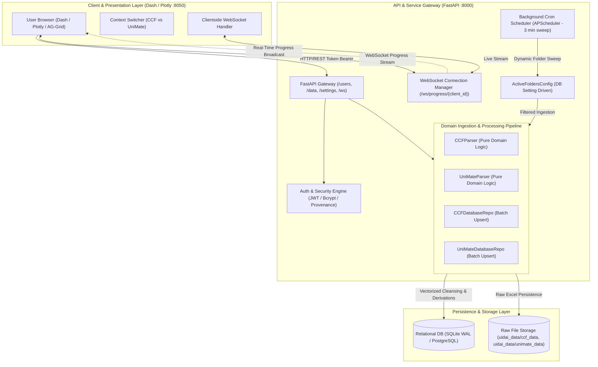
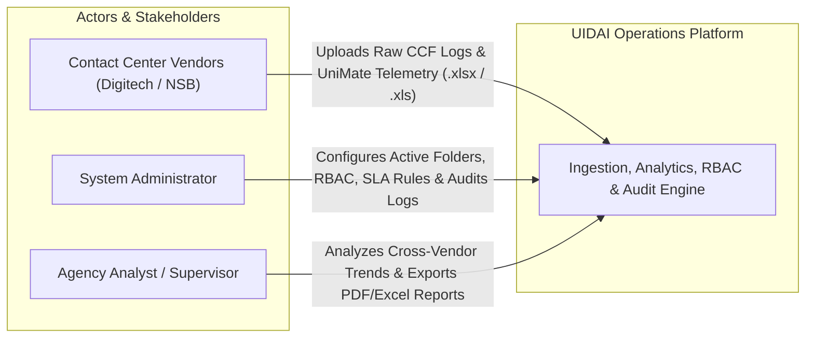
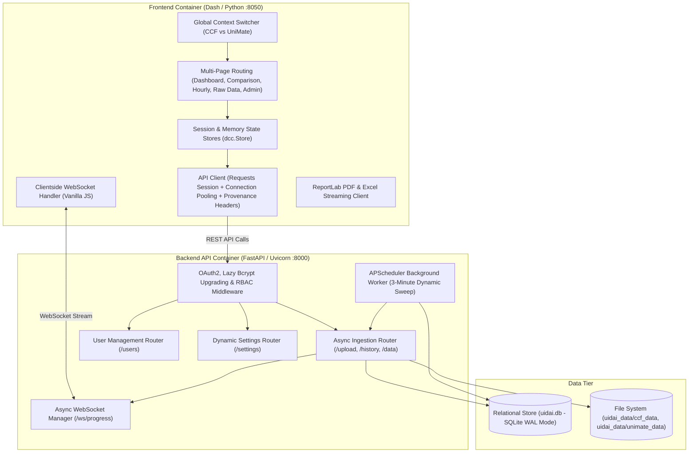
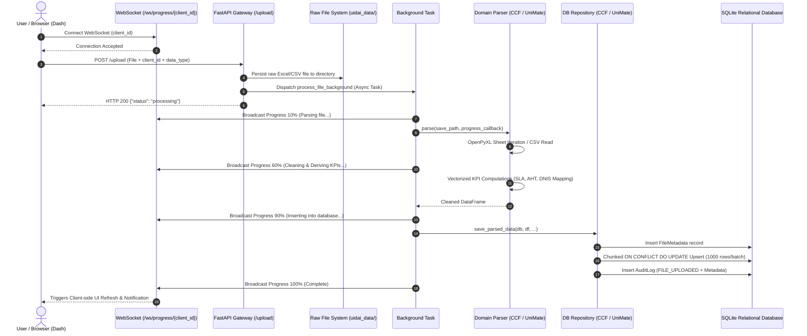
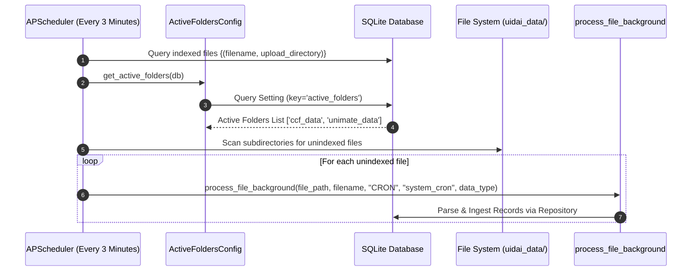
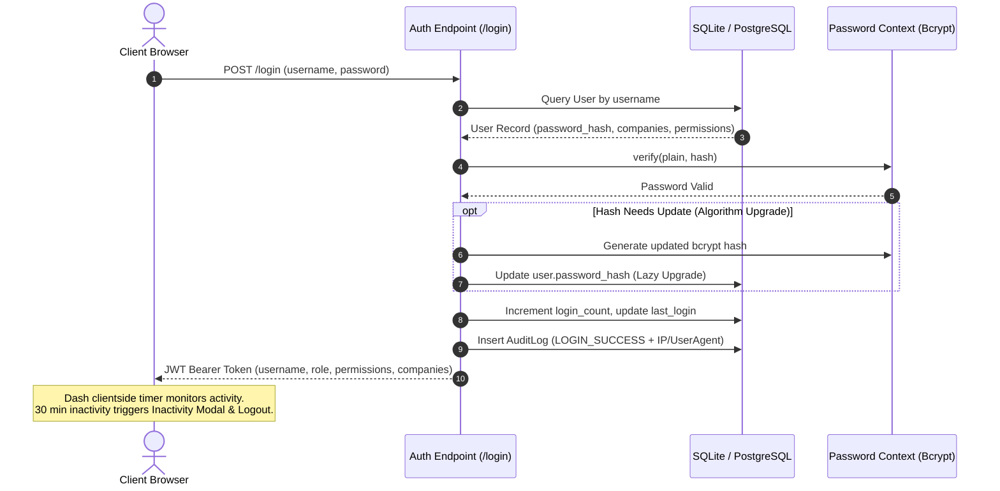
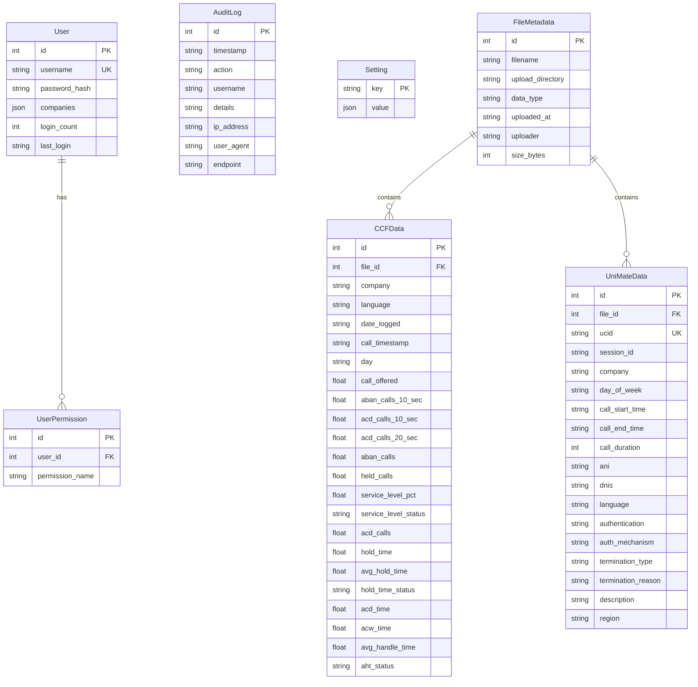

# UIDAI Contact Center Operations & Analytics Platform
## System Architecture & Technical Deep-Dive Specification

> **Document Classification:** Engineering Architecture & Operational Blueprint  
> **Target Audience:** Technical Leadership, System Architects, Core Engineering Team  
> **Status:** Active / Production-Ready  
> **Last Updated:** August 2026

---

## 1. Executive Summary & System Vision

The **UIDAI Contact Center Operations & Analytics Platform** is a specialized, multi-tenant analytics and operational intelligence system engineered to ingest, analyze, monitor, and audit national-scale Contact Center Facility (CCF) operations and interactive voice response (IVR/UniMate) customer journeys.

The platform bridges high-volume contact center operational telemetry (call volumes, agent handle times, service level agreements, abandoned call rates, IVR journeys) and executive reporting. It features a distributed architecture combining a **FastAPI backend** (asynchronous ETL pipeline, pure domain parsing engines, repository-backed idempotent upserts, RBAC, provenance audit logging, dynamic directory scheduling) with an **interactive Dash/Plotly analytical frontend** (featuring dynamic context switching, multi-page analytics, client-side session protection, and AG-Grid data exploration).



---

## 2. High-Level Architecture & System Boundaries

### 2.1 System Context



### 2.2 Container Topology



---

## 3. Domain Model & Ubiquitous Language

The domain model follows strict Domain-Driven Design (DDD) principles:

| Domain Term | Canonical Definition | Mathematical / Logic Model |
| :--- | :--- | :--- |
| **Service Level (SL %)** | The percentage of answered calls connected within threshold (&le; 20s). | `SL % = (ACD_Calls_20s / (Call_Offered - ABAN_10s)) * 100` |
| **Weighted Average SL** | Period-level Service Level aggregated across all volume intervals rather than naive arithmetic mean. | `Sum(ACD_Calls_20s) / Sum(Call_Offered - ABAN_10s) * 100` |
| **Average Handle Time (AHT)** | Total time an agent spends processing a customer interaction across talk, hold, and after-call work. | `AHT = (Talk_Time + Hold_Time + ACW_Time) / Total_ACD_Calls` |
| **Average Hold Time** | Average duration a caller is placed on hold per answered interaction. | `Avg_Hold = Total_Hold_Time / Total_ACD_Calls` |
| **Answer Rate** | Proportion of offered calls successfully answered by agents. | `Answer_Rate = (Total_ACD_Calls / Total_Call_Offered) * 100` |
| **SLA Score Thresholds** | Operational grading rules distinguishing healthy performance from contract penalty breaches. | &bull; `SL % > 85%` &rarr; Good, else Penalty<br>&bull; `AHT <= 240s` &rarr; Good, else Penalty<br>&bull; `Avg Hold <= 20s` &rarr; Good, else Penalty |
| **DNIS Company Mapping** | Identification of vendor attribution in UniMate IVR streams based on dialed number prefix. | &bull; `DNIS starts with 56` &rarr; Digitech<br>&bull; `DNIS starts with 57` &rarr; NSB<br>&bull; Others &rarr; Unknown |
| **Dynamic Time Bucketing** | Automated time-series aggregation resolution based on selected date ranges. | `≤7d` &rarr; Daily; `>31d` &rarr; Weekly (`W-MON`); `>90d` &rarr; Monthly (`MS`). |
| **Tenant Isolation** | Scoped data accessibility where tenant metrics are segmented at query time. | Query filtering constrained by JWT token claims (`companies` attribute). |
| **Lazy Password Upgrading** | Transparent cryptographic re-hashing upon login to update deprecated hashes. | Re-hashes on verified match if algorithm upgrade flag (`needs_update()`) is active. |
| **Provenance Audit Trail** | Strict attribution of system operations with forwarded client IP, user agent, and endpoint. | Captures `X-Forwarded-For`, `User-Agent`, action, and timestamp in `AuditLog`. |

---

## 4. Deep Module Architecture

```
┌─────────────────────────────────────────────────────────────┐
│                    FastAPI Router Layer                     │
└──────────────────────────────┬──────────────────────────────┘
                               │ (Clean Interface)
                               ▼
┌─────────────────────────────────────────────────────────────┐
│               Deep Domain Ingestion Modules                 │
├─────────────────────────────────────────────────────────────┤
│ • CCFParser / UniMateParser: Pure functional parsing        │
│   - Multi-sheet OpenPyXL parsing & concatenation            │
│   - Column sanitization & type coercion                     │
│   - Vectorized KPI derivations & SLA classification         │
│   - DNIS vendor mapping & duration normalization            │
├─────────────────────────────────────────────────────────────┤
│ • CCFDatabaseRepo / UniMateDatabaseRepo: Persistence Seam   │
│   - Chunked batch execution (batch_size=1000)               │
│   - ON CONFLICT DO UPDATE composite index idempotency       │
│   - Transactional metadata registration                     │
├─────────────────────────────────────────────────────────────┤
│ • WebSocket Connection Manager: Streaming Layer             │
│   - Real-time percentage & status updates                   │
└─────────────────────────────────────────────────────────────┘
```

### 4.1 Module Summary Table

| Module Seam | Public Interface | Implementation Depth (Encapsulated Complexity) |
| :--- | :--- | :--- |
| **`auth_utils`** | `verify_and_upgrade_password()`, `get_current_user()`, `PermissionChecker()`, `add_log()`, `archive_old_logs()`, `extract_request_metadata()` | JWT encoding/decoding, passlib context switching, fallback bcrypt compatibility, request IP/User-Agent extraction, 90-day automatic log retention pruning. |
| **`CCFParser`** | `CCFParser.parse(save_path, progress_callback)` | Multi-sheet Excel workbook iteration, column whitespace stripping, missing value imputation, vectorized numpy SLA/AHT/Hold penalty derivations. |
| **`UniMateParser`** | `UniMateParser.parse(save_path, progress_callback)` | CSV/Excel parsing, DNIS-based vendor assignment (`56*` vs `57*`), time string duration conversion (`HH:MM:SS` &rarr; seconds), regional language code mapping. |
| **`CCFDatabaseRepo`** | `CCFDatabaseRepo.save_parsed_data(...)` | `FileMetadata` creation, column dictionary mapping, 1000-row chunked batch execution, SQLite `on_conflict_do_update` upsert on `(company, language, call_timestamp)`. |
| **`UniMateDatabaseRepo`** | `UniMateDatabaseRepo.save_parsed_data(...)` | `FileMetadata` creation, column dictionary mapping, 1000-row chunked batch execution, SQLite `on_conflict_do_update` upsert on `(ucid)`. |
| **`ActiveFoldersConfig`** | `ActiveFoldersConfig.get_active_folders(db)` | Dynamic DB settings query (`Setting` table key `active_folders`) with fallback to `['ccf_data', 'unimate_data']` for scheduled background sweeps. |
| **`api_client`** | `ApiClient.get_dataframe()`, `ApiClient.login()`, `ApiClient.upload_file()` | Session pooling (`requests.Session`), client header propagation (`X-Forwarded-For`, `User-Agent`), client-side LRU memory caching. |
| **`theme & export`** | `get_plotly_template()`, `make_header_with_download()`, `wrap_graph_with_download()`, `generate_pdf_report()` | PostHog-inspired design tokens, ReportLab programmatic PDF compilation, dynamic Excel export dropdown bindings, skeleton loaders. |

---

## 5. End-to-End Data & Execution Lifecycles

### 5.1 Ingestion & Asynchronous ETL Lifecycle



### 5.2 Background Scheduled Directory Sweep Lifecycle



### 5.3 Authentication, Session & Inactivity Lifecycle



---

## 6. Database Schema & Relational Models



### 6.1 Table Constraint Details

- **`FileMetadata`**: Unique constraint on `(filename, upload_directory)` ensures distinct file tracking across separate data directories.
- **`CCFData`**: Unique composite constraint on `(company, language, call_timestamp)` guarantees idempotent re-upload and prevents duplicate interval inflation.
- **`UniMateData`**: Unique constraint on `(ucid)` guarantees idempotency for call-level IVR records.
- **`Setting`**: Key-value JSON store for system configuration (e.g., `active_folders`).

---

## 7. Architectural Decision Records (ADRs)

### ADR 0001: Asynchronous WebSocket Progress Streaming
* **Context**: Uploading multi-sheet 50MB workbooks with 100,000+ rows takes 5–15s. Synchronous HTTP POST blocks the client and risks connection timeouts.
* **Decision**: Adopt a dual-channel upload pattern: the client establishes a WebSocket connection with `client_id`, then fires an async POST. FastAPI spawns a background worker broadcasting real-time progress percentages over WebSocket.
* **Consequences**: Zero UI freezing, predictable user feedback, decoupled HTTP request timeout risks.

### ADR 0002: Relational Metrics Storage with Unique Composite Constraints
* **Context**: CCF operational logs are frequently re-uploaded with overlapping date ranges or revisions.
* **Decision**: Store all normalized records in a single relational table (`ccf_data`) constrained by `(company, language, call_timestamp)` and `unimate_data` constrained by `(ucid)`. Perform batch upserts using SQLite `on_conflict_do_update`.
* **Consequences**: Full idempotency during file re-uploads; prevents duplicate record inflation.

### ADR 0003: Connection-Forwarded Audit Logging with Provenance
* **Context**: The frontend communicates with the backend via an internal network client (`ApiClient`), which causes standard backend logging to record `127.0.0.1`.
* **Decision**: `ApiClient` extracts client request headers (`X-Forwarded-For`, `User-Agent`) and forwards them to FastAPI headers. Backend `extract_request_metadata()` captures true client origin.
* **Consequences**: Non-repudiation audit trails for compliance-sensitive operations.

### ADR 0004: Pure Domain Parsers & Repository Pattern Separation
* **Context**: Mixing file parsing, data cleaning, derived KPI computation, and database I/O in a single monolith causes high cognitive friction and impairs testability.
* **Decision**: Decompose dataset ingestion into pure domain parsers (`CCFParser`, `UniMateParser`) that return clean DataFrames, and dedicated persistence repositories (`CCFDatabaseRepo`, `UniMateDatabaseRepo`) that manage database transactions and batch upserts.
* **Consequences**: High leverage, clear seams, simplified unit testing, and straightforward addition of future datasets.

### ADR 0005: Dynamic DB-Configured Directory Sweep for Automated Ingestion
* **Context**: Contact center vendor files are dropped periodically into directory paths on the server. Hardcoding ingestion folders prevents dynamic administration.
* **Decision**: APScheduler runs every 3 minutes, reading enabled folders dynamically from the `Setting` table via `ActiveFoldersConfig`, scanning unindexed files, and triggering ingestion.
* **Consequences**: Zero downtime folder management; hands-free automated ingestion.

---

## 8. Production Hardware, Sizing & Kernel Tuning Profile

Designed for **1,000 concurrent sessions**:

- **Compute**: 4–8 vCPUs (Ubuntu 22.04 LTS or newer)
- **Memory**: 8GB – 16GB RAM (Optimized for in-memory Pandas dataframe slicing and Plotly rendering)
- **Storage**: 50GB+ Enterprise NVMe SSD (High IOPS for SQLite WAL operations)
- **Kernel Tuning (`/etc/sysctl.conf`)**:
  - `fs.file-max = 65535`
  - `net.ipv4.tcp_max_syn_backlog = 4096`
  - `net.ipv4.tcp_fin_timeout = 15`
- **Resource Limits (`/etc/security/limits.conf`)**:
  - `* soft nofile 65535`
  - `* hard nofile 65535`
- **Network Ports**:
  - `80` (HTTP), `443` (HTTPS/WSS) via Nginx Reverse Proxy
  - Internal Only: `8000` (FastAPI), `8050` (Dash)
