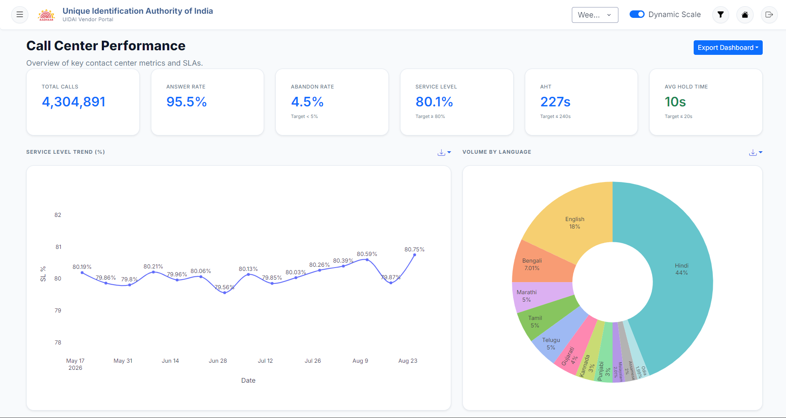
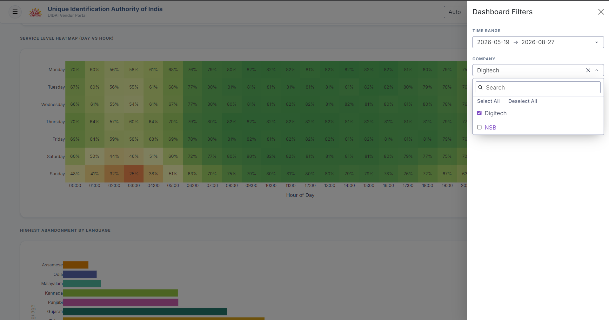
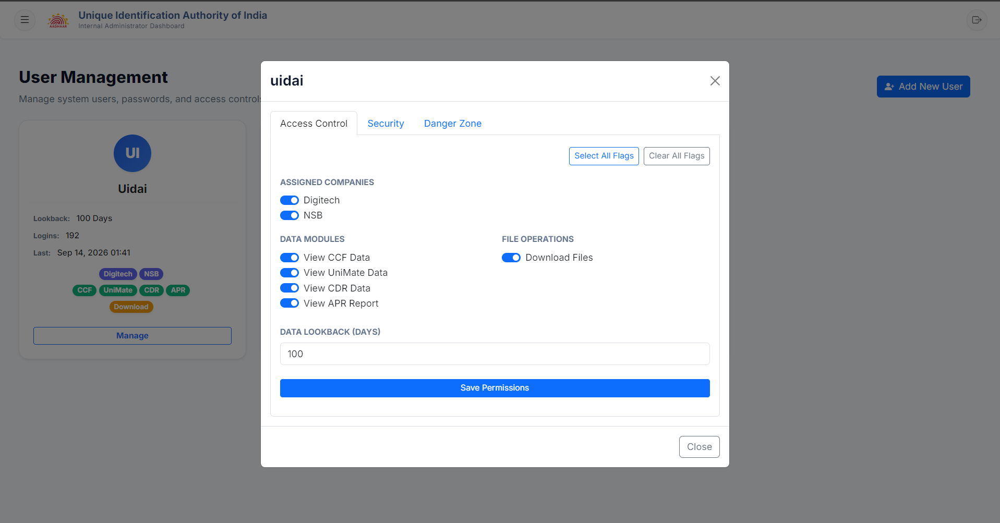
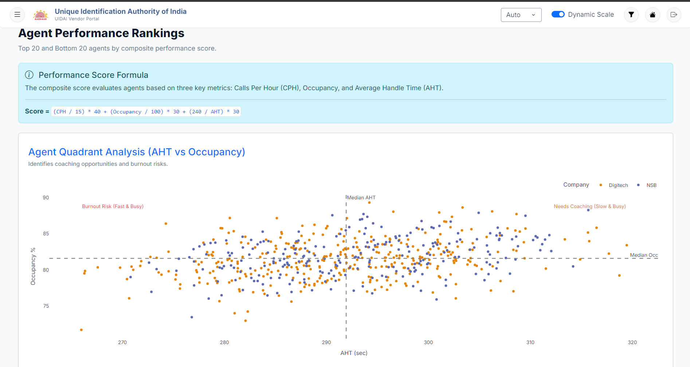

# UIDAI Dashboard (UIDAI Contact Center Operations & Analytics Platform)

## 1. Problem Statement
- Highly fragmented contact center operations across multiple vendors (e.g., Digitech, NSB).
- Lack of centralized visibility into critical SLA metrics, IVR journeys, and call abandonment.
- Manual aggregation of high-volume telephonic CCF (Contact Center Facility) and UniMate (IVR telemetry) data creates lag, errors, and prevents real-time operational decision-making.
- Need for unified, idempotent ingestion system with strict RBAC, tenant isolation, and non-repudiation audit trails.

## 2. Architecture Overview
- **Unified Monolith:** Dash/Plotly frontend mounted directly onto FastAPI backend. Single-port deployment.
- **Client Layer:** Dash, Plotly, AG-Grid for analytics. Clientside WebSocket handlers for real-time progress.
- **Service Layer:** FastAPI routing, JWT/Bcrypt auth, APScheduler cron engine, asynchronous ETL pipelines.
- **Persistence:** SQLite (WAL mode) relational store, raw file system storage for Excel/CSV payloads.
- *Note: See `architecture-deep-dive.md` for full component flow, design decisions, and failure handling.*

## 3. Scope and Capabilities
- **Multi-Tenant Ingestion:** Automated and manual ingestion of CCF and UniMate data streams. Vectorized KPI computation (AHT, SLA %, Answer Rate).
- **Dynamic Time Bucketing:** Auto-resampling of time-series (Daily/Weekly/Monthly) based on selected query range.
- **Interactive Analytics:** Bidirectional chart cross-filtering, operational KPI cards, hourly volume heatmaps.
- **Strict RBAC & Tenant Isolation:** Granular permissions (`can_view_global`, `can_view_scoped`). JWT claims restrict row-level data access by vendor/company.
- **Provenance Audit Logging:** Records operator identity, action, endpoint, and forwarded client origin (`X-Forwarded-For`, `User-Agent`).
- **Automated Directory Sweep:** Background cron (3-min interval) sweeps database-configured active folders for hands-free ingestion.

## 4. Tech Stack
- **Frontend:** Dash, Plotly, AG-Grid, ReportLab (exports).
- **Backend:** FastAPI, Uvicorn, APScheduler, Passlib (Bcrypt).
- **Data Processing:** Pandas, NumPy, OpenPyXL.
- **Database:** SQLite (WAL mode), Alembic (migrations).

## 5. Model Evaluation and Trade-offs
- **SQLite WAL vs PostgreSQL:** Chose SQLite WAL for zero-config, portable deployment. *Trade-off:* Prevents seamless horizontal scaling of backend nodes.
- **Dual-Channel WebSocket Uploads vs REST POST:** Chose WS + HTTP async POST. 50MB workbook ingestion blocks standard REST, risking timeouts. WS provides real-time progress without UI freeze. *Trade-off:* Higher connection management complexity.
- **Clientside `dcc.Store` vs Redis:** Chose browser memory caching. *Trade-off:* limits cache sharing across sessions, requires future Redis migration for high-concurrency scaling.
- **Pure Domain Parsers vs Monolithic ETL:** Extracted `CCFParser` and `UniMateParser` as stateless modules. *Trade-off:* Minor overhead in object mapping, but massive gain in testability and separation of concerns.

## 6. Future Scope
- **Redis Server-Side Caching:** Replace `dcc.Store` to support distributed worker horizontal scaling.
- **Safe Deletion Protocol:** Implement GitHub-style confirmation modals requiring explicit typed confirmation before user deactivation.
- **Enhanced Log Rotation:** Expand 90-day automated pruning to external object storage archiving for compliance.

---
## Dashboard Visuals [NOTE FOR AUTHOR: INSERT SCREENSHOTS HERE]

1. **Overview/Core-Metric View**
   *Take screenshot of: CCF Analytics main dashboard.*
   *Show: Top-level operational KPI cards (Call Volume, SLA, AHT) with SLA benchmark status tags (Red/Green) and temporal preset pills active.*
   

2. **Interactive/Filtered View**
   *Take screenshot of: Hourly Volume Heatmap or Trend Chart.*
   *Show: Active cross-filtering in action (e.g., clicked bar isolating 'Digitech' vendor), with active dismissible filter chips visible in the sticky control bar.*
  

3. User Managament. 
   

4. Custom Agent Ranking score Metric based on CPH, AHT and OCCUPANCY
